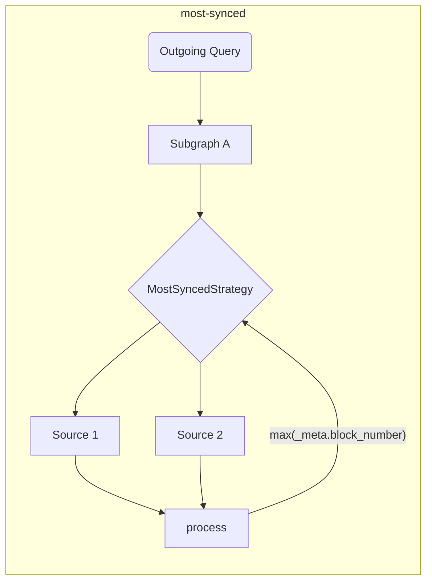

# The Graph Client Tools

This repo is the home for [The Graph](https://thegraph.com) consumer-side tools (for both browser and NodeJS environments).

## Background

The tools provided in this repo are intended to enrich and extend the DX, and add the additional layer required for dApps in order to implement distributed applications.

Developers who consume data from [The Graph](https://thegraph.com) GraphQL API often need peripherals for making data consumption easier, and also tools that allow using multiple indexers at the same time.

## Features and Goals

This library is intended to simplify the network aspect of data consumption for dApps. The tools provided within this repository are intended to run at build time, in order to make execution faster and performant at runtime.

> The tools provided in this repo can be used as standalone, but you can also use it with any existing GraphQL Client!

| Status | Feature                                                          | Notes                                                                                                                            |
| :----: | ---------------------------------------------------------------- | -------------------------------------------------------------------------------------------------------------------------------- |
|   ✅   | Multiple indexers                                                | based on fetch strategies                                                                                                        |
|   ✅   | Fetch Strategies                                                 | timeout, retry, fallback, race, highestValue                                                                                     |
|   ✅   | Build time validations & optimizations                           |                                                                                                                                  |
|   ✅   | Client-Side Composition                                          | with improved execution planner (based on GraphQL-Mesh)                                                                          |
|   ✅   | Cross-chain Subgraph Handling                                    | Use similar subgraphs as a single source                                                                                         |
|   ✅   | Raw Execution (standalone mode)                                  | without a wrapping GraphQL client                                                                                                |
|   ✅   | Local (client-side) Mutations                                    |                                                                                                                                  |
|   ✅   | [Automatic Block Tracking](../packages/block-tracking/README.md) | tracking block numbers [as described here](https://thegraph.com/docs/en/developer/distributed-systems/#polling-for-updated-data) |
|   ✅   | [Automatic Pagination](../packages/auto-pagination/README.md)    | doing multiple requests in a single call to fetch more than the indexer limit                                                    |
|   ✅   | Integration with `@apollo/client`                                |                                                                                                                                  |
|   ✅   | Integration with `urql`                                          |                                                                                                                                  |
|   ✅   | TypeScript support                                               | with built-in GraphQL Codegen and `TypedDocumentNode`                                                                            |
|   ✅   | [`@live` queries](./live.md)                                     | Based on polling                                                                                                                 |

> You can find an [extended architecture design here](./architecture.md)

## Getting Started

You can follow [Episode 45 of `graphql.wtf`](https://graphql.wtf/episodes/45-the-graph-client) to learn more about Graph Client:

[](https://graphql.wtf/episodes/45-the-graph-client)

To get started, make sure to install [The Graph Client CLI] in your project:

```sh
yarn add -D @graphprotocol/client-cli
# or, with NPM:
npm install --save-dev @graphprotocol/client-cli
```

> The CLI is installed as dev dependency since we are using it to produce optimized runtime artifacts that can be loaded directly from your app!

Create a configuration file (called `.graphclientrc.yml`) and point to your GraphQL endpoints provided by The Graph, for example:

```yml
# .graphclientrc.yml
sources:
  - name: uniswapv2
    handler:
      graphql:
        endpoint: https://api.thegraph.com/subgraphs/name/uniswap/uniswap-v2
```

Now, create a runtime artifact by running The Graph Client CLI:

```sh
graphclient build
```

> Note: you need to run this with `yarn` prefix, or add that as a script in your `package.json`.

This should produce a ready-to-use standalone `execute` function, that you can use for running your application GraphQL operations, you should have an output similar to the following:

```sh
GraphClient: Cleaning existing artifacts
GraphClient: Reading the configuration
🕸️: Generating the unified schema
🕸️: Generating artifacts
🕸️: Generating index file in TypeScript
🕸️: Writing index.ts for ESM to the disk.
🕸️: Cleanup
🕸️: Done! => .graphclient
```

Now, the `.graphclient` artifact is generated for you, and you can import it directly from your code, and run your queries:

```ts
import { execute } from '../.graphclient'

const myQuery = gql`
  query pairs {
    pair(id: "0x00004ee988665cdda9a1080d5792cecd16dc1220") {
      id
      token0 {
        id
        symbol
        name
      }
      token1 {
        id
        symbol
        name
      }
    }
  }
`

async function main() {
  const result = await execute(myQuery, {})
  console.log(result)
}

main()
```

### Using Vanilla JavaScript Instead of TypeScript

GraphClient CLI generates the client artifacts as TypeScript files by default, but you can configure CLI to generate JavaScript and JSON files together with additional TypeScript definition files by using `--fileType js` or `--fileType json`.

`js` flag generates all files as JavaScript files with ESM Syntax and `json` flag generates source artifacts as JSON files while entrypoint JavaScript file with old CommonJS syntax because only CommonJS supports JSON files as modules.

Unless you use CommonJS(`require`) specifically, we'd recommend you to use `js` flag.

`graphclient --fileType js`

- [An example for JavaScript usage in CommonJS syntax with JSON files](../examples/javascript-cjs)
- [An example for JavaScript usage in ESM syntax](../examples/javascript-esm)

#### The Graph Client DevTools

The Graph Client CLI comes with a built-in GraphiQL, so you can experiment with queries in real-time.

The GraphQL schema served in that environment, is the eventual schema based on all composed Subgraphs and transformations you applied.

To start the DevTool GraphiQL, run the following command:

```sh
graphclient serve-dev
```

And open http://localhost:4000/ to use GraphiQL. You can now experiment with your Graph client-side GraphQL schema locally! 🥳

#### Examples

You can also refer to [examples directory in this repo](../examples), for more advanced examples and integration examples:

- [TypeScript & React example with raw `execute` and built-in GraphQL-Codegen](../examples/execute)
- [TS/JS NodeJS standalone mode](../examples/node)
- [Client-Side GraphQL Composition](../examples/composition)
- [Integration with Urql and React](../examples/urql)
- [Integration with NextJS and TypeScript](../examples/nextjs)
- [Integration with Apollo-Client and React](../examples/apollo)
- [Integration with React-Query](../examples/react-query)
- _Cross-chain merging (same Subgraph, different chains)_
- - [Parallel SDK calls](../examples/cross-chain-sdk)
- - [Parallel internal calls with schema extensions](../examples/cross-chain-extension)
- [Customize execution with Transforms (auto-pagination and auto-block-tracking)](../examples/transforms)

### Advanced Examples/Features

#### Customize Network Calls

You can customize the network execution (for example, to add authentication headers) by using `operationHeaders`:

```yaml
sources:
  - name: uniswapv2
    handler:
      graphql:
        endpoint: https://api.thegraph.com/subgraphs/name/uniswap/uniswap-v2
        operationHeaders:
          Authorization: Bearer MY_TOKEN
```

You can also use runtime variables if you wish, and specify it in a declarative way:

```yaml
sources:
  - name: uniswapv2
    handler:
      graphql:
        endpoint: https://api.thegraph.com/subgraphs/name/uniswap/uniswap-v2
        operationHeaders:
          Authorization: Bearer {context.config.apiToken}
```

Then, you can specify that when you execute operations:

```ts
execute(myQuery, myVariables, {
  config: {
    apiToken: 'MY_TOKEN',
  },
})
```

> You can find the [complete documentation for the `graphql` handler here](https://graphql-mesh.com/docs/handlers/graphql#config-api-reference).

#### Environment Variables Interpolation

If you wish to use environment variables in your Graph Client configuration file, you can use interpolation with `env` helper:

```yaml
sources:
  - name: uniswapv2
    handler:
      graphql:
        endpoint: https://api.thegraph.com/subgraphs/name/uniswap/uniswap-v2
        operationHeaders:
          Authorization: Bearer {env.MY_API_TOKEN} # runtime
```

Then, make sure to have `MY_API_TOKEN` defined when you run `process.env` at runtime.

You can also specify environment variables to be filled at build time (during `graphclient build` run) by using the env-var name directly:

```yaml
sources:
  - name: uniswapv2
    handler:
      graphql:
        endpoint: https://api.thegraph.com/subgraphs/name/uniswap/uniswap-v2
        operationHeaders:
          Authorization: Bearer ${MY_API_TOKEN} # build time
```

> You can find the [complete documentation for the `graphql` handler here](https://graphql-mesh.com/docs/handlers/graphql#config-api-reference).

#### Fetch Strategies and Multiple Graph Indexers

It's a common practice to use more than one indexer in dApps, so to achieve the ideal experience with The Graph, you can specify several `fetch` strategies in order to make it more smooth and simple.

All `fetch` strategies can be combined to create the ultimate execution flow.

<details>
 <summary>`retry`</summary>

The `retry` mechanism allow you to specify the retry attempts for a single GraphQL endpoint/source.

The retry flow will execute in both conditions: a netword error, or due to a runtime error (indexing issue/inavailability of the indexer).

```yaml
sources:
  - name: uniswapv2
    handler:
      graphql:
        endpoint: https://api.thegraph.com/subgraphs/name/uniswap/uniswap-v2
        retry: 2 # specify here, if you have an unstable/error prone indexer
```

</details>

<details>
 <summary>`timeout`</summary>

The `timeout` mechanism allow you to specify the `timeout` for a given GraphQL endpoint.

```yaml
sources:
  - name: uniswapv2
    handler:
      graphql:
        endpoint: https://api.thegraph.com/subgraphs/name/uniswap/uniswap-v2
        timeout: 5000 # 5 seconds
```

</details>

<details>
 <summary>`fallback`</summary>

The `fallback` mechanism allow you to specify use more than one GraphQL endpoint, for the same source.

This is useful if you want to use more than one indexer for the same Subgraph, and fallback when an error/timeout happens. You can also use this strategy in order to use a custom indexer, but allow it to fallback to [The Graph Hosted Service](https://thegraph.com/hosted-service).

```yaml
sources:
  - name: uniswapv2
    handler:
      graphql:
        strategy: fallback
        sources:
          - endpoint: https://bad-uniswap-v2-api.com
            retry: 2
            timeout: 5000
          - endpoint: https://api.thegraph.com/subgraphs/name/uniswap/uniswap-v2
```

</details>

<details>
 <summary>`race`</summary>

The `race` mechanism allow you to specify use more than one GraphQL endpoint, for the same source, and race on every execution.

This is useful if you want to use more than one indexer for the same Subgraph, and allow both sources to race and get the fastest response from all specified indexers.

```yaml
sources:
  - name: uniswapv2
    handler:
      graphql:
        strategy: race
        sources:
          - endpoint: https://bad-uniswap-v2-api.com
          - endpoint: https://api.thegraph.com/subgraphs/name/uniswap/uniswap-v2
```

</details>

<details>
  <summary>`highestValue`</summary>
  
  This strategy allows you to send parallel requests to different endpoints for the same source and choose the most updated.

This is useful if you want to choose most synced data for the same Subgraph over different indexers/sources.

```yaml
sources:
  - name: uniswapv2
    handler:
      graphql:
        strategy: highestValue
        strategyConfig:
          selectionSet: |
            {
              _meta {
                block {
                  number
                }
              }
            }
          value: '_meta.block.number'
        sources:
          - endpoint: https://api.thegraph.com/subgraphs/name/uniswap/uniswap-v2-1
          - endpoint: https://api.thegraph.com/subgraphs/name/uniswap/uniswap-v2-2
```



</details>

#### Block Tracking

The Graph Client can track block numbers and do the following queries by following [this pattern](https://thegraph.com/docs/en/developer/distributed-systems/#polling-for-updated-data) with `blockTracking` transform;

```yaml
sources:
  - name: uniswapv2
    handler:
      graphql:
        endpoint: https://api.thegraph.com/subgraphs/name/uniswap/uniswap-v2
    transforms:
      - blockTracking:
          # You might want to disable schema validation for faster startup
          validateSchema: true
          # Ignore the fields that you don't want to be tracked
          ignoreFieldNames: [users, prices]
          # Exclude the operation with the following names
          ignoreOperationNames: [NotFollowed]
```

[You can try a working example here](../examples/transforms)

#### Automatic Pagination

With most subgraphs, the number of records you can fetch is limited. In this case, you have to send multiple requests with pagination.

```graphql
query {
  # Will throw an error if the limit is 1000
  users(first: 2000) {
    id
    name
  }
}
```

So you have to send the following operations one after the other:

```graphql
query {
  # Will throw an error if the limit is 1000
  users(first: 1000) {
    id
    name
  }
}
```

Then after the first response:

```graphql
query {
  # Will throw an error if the limit is 1000
  users(first: 1000, skip: 1000) {
    id
    name
  }
}
```

After the second response, you have to merge the results manually. But instead The Graph Client allows you to do the first one and automatically does those multiple requests for you under the hood.

All you have to do is:

```yaml
sources:
  - name: uniswapv2
    handler:
      graphql:
        endpoint: https://api.thegraph.com/subgraphs/name/uniswap/uniswap-v2
    transforms:
      - autoPagination:
          # You might want to disable schema validation for faster startup
          validateSchema: true
```

[You can try a working example here](../examples/transforms)

#### Client-side Composition

The Graph Client has built-in support for client-side GraphQL Composition (powered by [GraphQL-Tools Schema-Stitching](https://graphql-tools.com/docs/schema-stitching/stitch-combining-schemas)).

You can leverage this feature in order to create a single GraphQL layer from multiple Subgraphs, deployed on multiple indexers.

> 💡 Tip: You can compose any GraphQL sources, and not only Subgraphs!

Trivial composition can be done by adding more than one GraphQL source to your `.graphclientrc.yml` file, here's an example:

```yaml
sources:
  - name: uniswapv2
    handler:
      graphql:
        endpoint: https://api.thegraph.com/subgraphs/name/uniswap/uniswap-v2
  - name: compoundv2
    handler:
      graphql:
        endpoint: https://api.thegraph.com/subgraphs/name/graphprotocol/compound-v2
```

As long as there a no conflicts across the composed schemas, you can compose it, and then run a single query to both Subgraphs:

```graphql
query myQuery {
  # this one is coming from compound-v2
  markets(first: 7) {
    borrowRate
  }
  # this one is coming from uniswap-v2
  pair(id: "0x00004ee988665cdda9a1080d5792cecd16dc1220") {
    id
    token0 {
      id
    }
    token1 {
      id
    }
  }
}
```

You can also resolve conflicts, rename parts of the schema, add custom GraphQL fields, and modify the entire execution phase.

For advanced use-cases with composition, please refer to the following resources:

- [Advanced Composition Example](../examples/composition)
- [GraphQL-Mesh Schema transformations](https://graphql-mesh.com/docs/transforms/transforms-introduction)
- [GraphQL-Tools Schema-Stitching documentation](https://graphql-tools.com/docs/schema-stitching/stitch-combining-schemas)

#### TypeScript Support

If your project is written in TypeScript, you can leverage the power of [`TypedDocumentNode`](https://the-guild.dev/blog/typed-document-node) and have a fully-typed GraphQL client experience.

The standalone mode of The GraphQL, and popular GraphQL client libraries like Apollo-Client and urql has built-in support for `TypedDocumentNode`!

The Graph Client CLI comes with a ready-to-use configuration for [GraphQL Code Generator](https://graphql-code-generator.com), and it can generate `TypedDocumentNode` based on your GraphQL operations.

To get started, define your GraphQL operations in your application code, and point to those files using the `documents` section of `.graphclientrc.yml`:

```yaml
sources:
  -  # ... your Subgraphs/GQL sources here

documents:
  - ./src/example-query.graphql
```

You can also use Glob expressions, or even point to code files, and the CLI will find your GraphQL queries automatically:

```yaml
documents:
  - './src/**/*.graphql'
  - './src/**/*.{ts,tsx,js,jsx}'
```

Now, run the GraphQL CLI `build` command again, the CLI will generate a `TypedDocumentNode` object under `.graphclient` for every operation found.

> Make sure to name your GraphQL operations, otherwise it will be ignored!

For example, a query called `query ExampleQuery` will have the corresponding `ExampleQueryDocument` generated in `.graphclient`. You can now import it and use that for your GraphQL calls, and you'll have a fully typed experience without writing or specifying any TypeScript manually:

```ts
import { ExampleQueryDocument, execute } from '../.graphclient'

async function main() {
  // "result" variable is fully typed, and represents the exact structure of the fields you selected in your query.
  const result = await execute(ExampleQueryDocument, {})
  console.log(result)
}
```

> You can find a [TypeScript project example here](../examples/urql).

#### Client-Side Mutations

Due to the nature of Graph-Client setup, it is possible to add client-side schema, that you can later bridge to run any arbitrary code.

This is helpful since you can implement custom code as part of your GraphQL schema, and have it as unified application schema that is easier to track and develop.

> This document explains how to add custom mutations, but in fact you can add any GraphQL operation (query/mutation/subscriptions). See [Extending the unified schema article](https://graphql-mesh.com/docs/guides/extending-unified-schema) for more information about this feature.

To get started, define a `additionalTypeDefs` section in your config file:

```yaml
additionalTypeDefs: |
  # We should define the missing `Mutation` type
  extend schema {
    mutation: Mutation
  }

  type Mutation {
    doSomething(input: SomeCustomInput!): Boolean!
  }

  input SomeCustomInput {
    field: String!
  }
```

Then, add a pointer to a custom GraphQL resolvers file:

```yaml
additionalResolvers:
  - './resolvers'
```

Now, create `resolver.js` (or, `resolvers.ts`) in your project, and implement your custom mutation:

```js
module.exports = {
  Mutation: {
    async doSomething(root, args, context, info) {
      // Here, you can run anything you wish.
      // For example, use `web3` lib, connect a wallet and so on.

      return true
    },
  },
}
```

If you are using TypeScript, you can also get fully type-safe signature by doing:

```ts
import { Resolvers } from './.graphclient'

// Now it's fully typed!
const resolvers: Resolvers = {
  Mutation: {
    async doSomething(root, args, context, info) {
      // Here, you can run anything you wish.
      // For example, use `web3` lib, connect a wallet and so on.

      return true
    },
  },
}

export default resolvers
```

If you need to inject runtime variables into your GraphQL execution `context`, you can use the following snippet:

```ts
execute(
  MY_QUERY,
  {},
  {
    myHelper: {}, // this will be available in your Mutation resolver as `context.myHelper`
  },
)
```

> [You can read more about client-side schema extensions here](https://graphql-mesh.com/docs/guides/extending-unified-schema)

> [You can also delegate and call Query fields as part of your mutation](https://graphql-mesh.com/docs/guides/extending-unified-schema#using-the-sdk-to-fetch-sources)

## License

Released under the [MIT license](../LICENSE).
