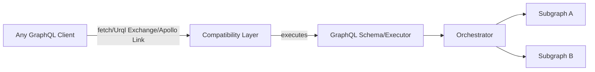
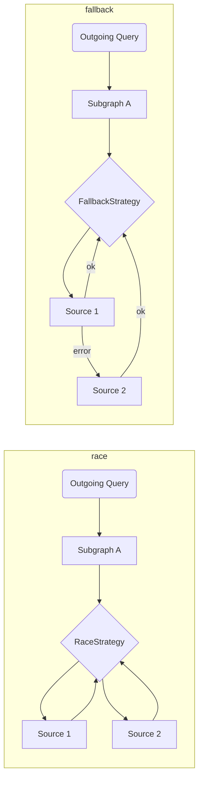

### The Graph Client Architecture

To address the need to support a distributed network, we plan to take several actions to ensure The Graph client provides everything app needs:

1. Compose multiple Subgraphs (on the client-side)
2. Fallback to multiple indexers/sources/hosted services
3. Automatic/Manual source picking strategy 
4. Agnostic core, with the ability to run integrate with any GraphQL client

Within every Subgraph defined as source, there will be a way to define it's source(s) indexer and the querying strategy, here are a few options: 

