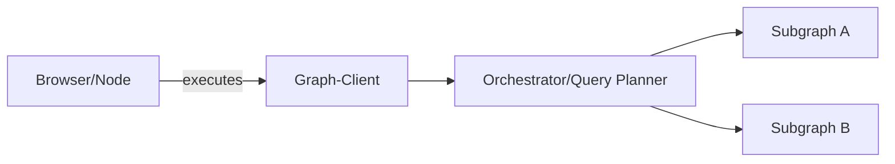
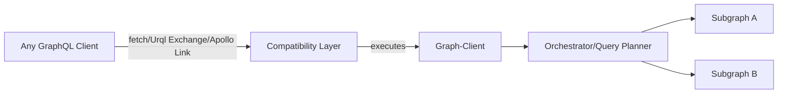
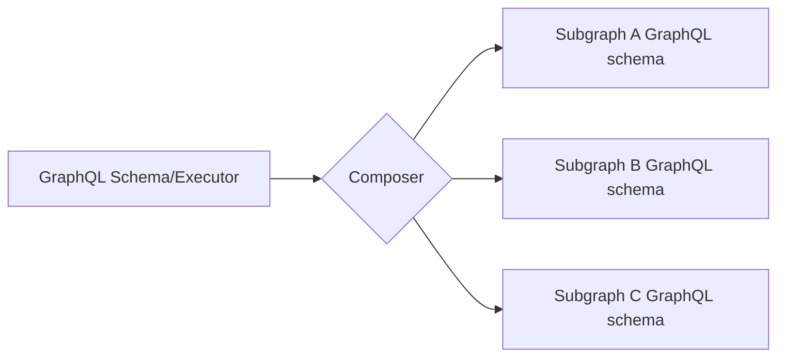
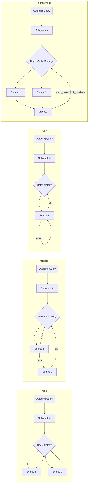
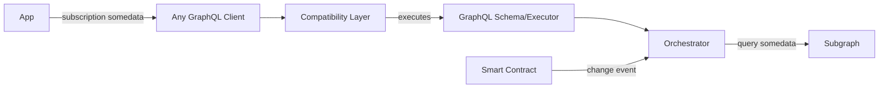

# The Graph Client Architecture

To address the need to support a distributed network, we plan to take several actions to ensure The Graph client provides everything app needs:

1. Compose multiple Subgraphs (on the client-side)
2. Fallback to multiple indexers/sources/hosted services
3. Automatic/Manual source picking strategy
4. Agnostic core, with the ability to run integrate with any GraphQL client

## Standalone mode

## With any GraphQL client

## Subgraph Composition

To allow simple and efficient client-side composition, we'll use [`graphql-tools`](https://graphql-tools.com) to create a remote schema / Executor, then can be hooked into the GraphQL client.

API could be either raw `graphql-tools` transformers, or using [GraphQL-Mesh declarative API](https://graphql-mesh.com/docs/transforms/transforms-introduction) for composing the schema.

## Subgraph Execution Strategies

Within every Subgraph defined as source, there will be a way to define it's source(s) indexer and the querying strategy, here are a few options:

> We can ship a several built-in strategies, along with a simple interfaces to allow developers to write their own.

To take the concept of strategies to the extreme, we can even build a magical layer that does subscription-as-query, with any hook, and provide a smooth DX for dapps:

With this mechanism, developers can write and execute GraphQL `subscription`, but under the hood we'll execute a GraphQL `query` to The Graph indexers, and allow to connect any external hook/probe for re-running the operation.
This way, we can watch for changes on the Smart Contract itself, and the GraphQL client will fill the gap on the need to real-time changes from The Graph.
