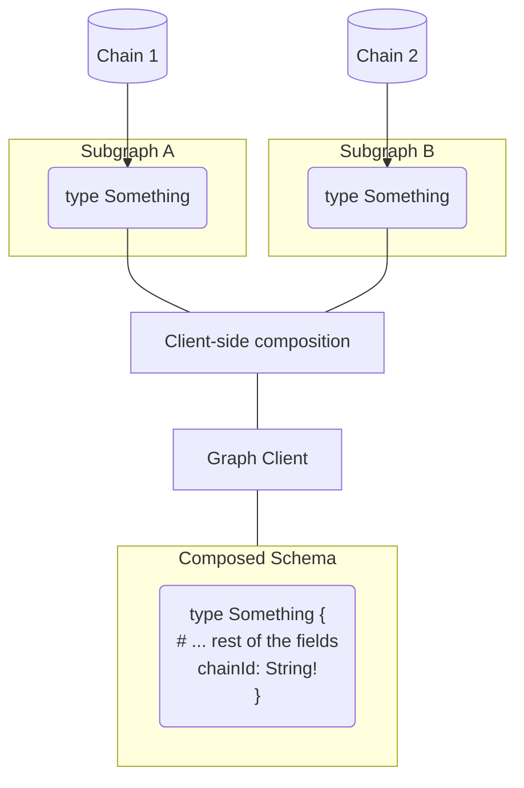

### The Graph Client / NodeJS (TS)

This examples integrates The Graph Client with NodeJS/TypeScript usage, with 2 Subgraphs that has similar GraphQL schemas. The goal of this example is to do requests to different subgraphs with dynamic context values

The example here is using the following tools/concepts:

- NodeJS + TypeScript
- The Graph Client CLI for generating artifacts
- [Schema-stitching resolvers extension](https://www.graphql-mesh.com/docs/guides/extending-unified-schema)



### Getting Started

To run this example, make sure to install the dependencies in the root of the monorepo, build the client locally, and then run this example:

```
# In the root directory
$ yarn install
$ yarn build
$ cd examples/cross-chain-sdk
$ yarn build-client
$ yarn start
```

### DevTools

You can also run The Graph Client DevTools by running: `yarn graphiql`.
