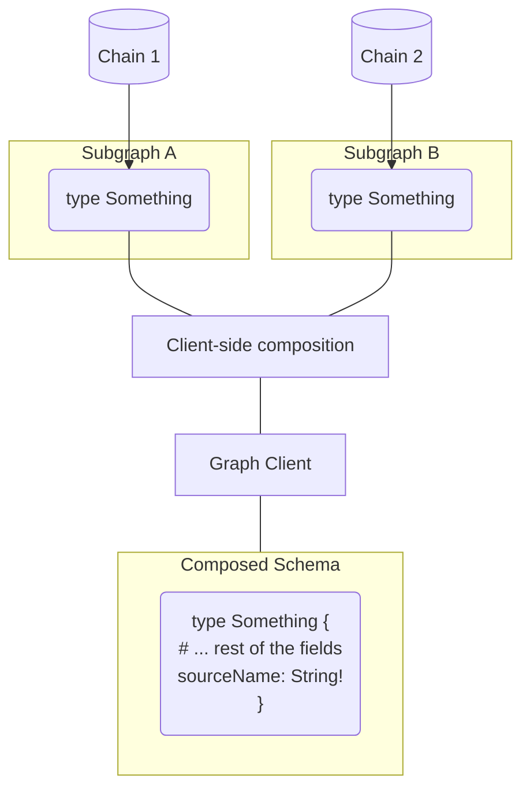

### The Graph Client / NodeJS (TS)

This examples integrates The Graph Client with NodeJS/TypeScript usage, with 2 Subgraphs that has similar GraphQL schemas. The goal of this example is to merge the two responses in a custom way, so the GraphQL layer does all aggregations needed.

The example here is using the following tools/concepts:

- NodeJS + TypeScript
- The Graph Client CLI for generating artifacts
- [Schema-stitching type-merging](https://www.graphql-tools.com/docs/schema-stitching/stitch-type-merging)
- [Schema-stitching resolvers extension](https://www.graphql-mesh.com/docs/guides/extending-unified-schema)
- Client-side Compostion (more than 1 source)



### Getting Started

To run this example, make sure to install the dependencies in the root of the monorepo, build the client locally, and then run this example:

```
# In the root directory
$ yarn install
$ yarn build
$ cd examples/cross-chain
$ yarn build-client
$ yarn start
```

### Using `addSourceName`

Graph-Client comes with a built-in utility for injecting the name of the source as part of each `type` definition. This is useful in case you need to know where each object came from, and distinguish the Subgraph created the object.

To use this feature, add `transforms` to each source:

```yaml
sources:
  - name: Chain1
    handler:
      graphql:
        endpoint: https://api.thegraph.com/subgraphs/name/uniswap/uniswap-v2
    transforms:
      - addSourceName: true # Add this
```

Now, in every GraphQL `type`, you'll have a new field added (`sourceName: String!`), that represent the `name` defined for that source.

You can include that in your GraphQL query, and use the field as a way to distinguish the origin of the object:

```graphql
query crossChainPairs {
  pairs(subgraphError: allow) {
    id
    sourceName
    token0 {
      id
    }
    token1 {
      id
    }
  }
}
```

### DevTools

You can also run The Graph Client DevTools by running: `yarn graphiql`.

```

```
